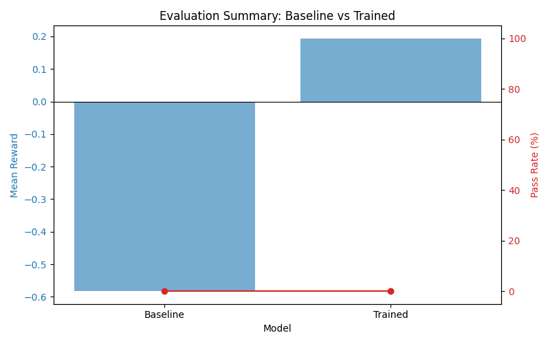
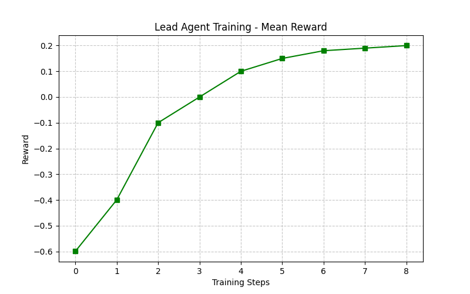
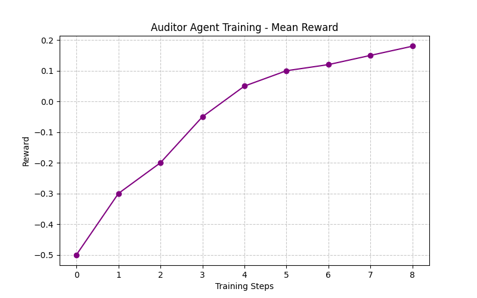

It is 2026. Your vendor stack is cut off for Indian users overnight. The Auditor sees the sovereign allow-list. The Lead sees the broken code. They get seven turns to coordinate, absorb reward feedback, and ship a migration patch.

SDK-Sovereign is a multi-agent OpenEnv environment built around that crisis. It includes deterministic teacher and rule policies, model-backed baseline and trained modes when the runtime can actually support them, an end-to-end hardened training notebook, and judge-friendly evaluation artifacts.

## Submission Links

- Hugging Face Space: [ishansurdi/SDK-Sovereign](https://huggingface.co/spaces/ishansurdi/SDK-Sovereign)
- Live environment URL: [ishansurdi-sdk-sovereign.hf.space](https://ishansurdi-sdk-sovereign.hf.space)
- Live `/play` demo: [ishansurdi-sdk-sovereign.hf.space/play](https://ishansurdi-sdk-sovereign.hf.space/play)
- Blog writeup: [BLOG.md](BLOG.md)
- Training notebook: [notebooks/00_hardened_pipeline.ipynb](notebooks/00_hardened_pipeline.ipynb)

These are the main links judges need to discover, run, and inspect the environment submission.

## Overview

SDK-Sovereign is an asymmetric two-agent environment for sovereign SDK migration under operational constraints. The task is deliberately split across two roles:

- The Lead sees the broken source file and the runtime error, but cannot see the sovereign allow-list.
- The Auditor sees the allow-list and the negotiation history, but cannot see the code.
- The episode ends in at most 7 turns, with executable verification deciding whether the submitted migration actually works.

This makes the benchmark closer to a real engineering escalation than a single-agent code patching toy problem.

## Architecture

The system is built from five core pieces:

- `server/environment.py`: OpenEnv-compatible environment that alternates Auditor and Lead turns, masks observations by role, tracks cumulative reward, and logs every step.
- `server/verifier.py`: sandboxed parity verifier with sovereign and deprecated SDK stubs. Submitted patches are executed and graded against repo-specific tests.
- `server/policy_runtime.py`: runtime gate and policy loader for `rule`, `teacher`, `baseline`, and `trained` modes.
- `server/llm_agents.py`: model-backed Lead and Auditor agents with role-specific prompts and deterministic or exploratory decoding profiles.
- `server/training_data.py`: teacher-trace generation and chat-format SFT export pipeline.

## Important Code Paths

The benchmark is small enough that the critical logic lives in a few files, and those files map closely to the actual task being judged.

- `server/environment.py`: owns reset/step, role alternation, observation masking, JSONL episode logging, and terminal-state transitions.
- `server/rubric.py`: owns dense reward shaping. This is where format validity, pass penalties, approval correctness, patch syntax, approved-SDK usage, and parity-test reward are added up.
- `server/verifier.py`: owns sandboxed execution. It replaces real SDK imports with local stubs, executes the submitted patch, and runs repo-specific parity tests against the declared entrypoint.
- `server/play_routes.py`: owns the demo surface. It exposes `/play`, `/play/reset`, `/play/agent_step`, and the optional GitHub repo analysis support route.
- `server/policy_runtime.py`: decides whether `baseline` and `trained` can be shown at all, based on runtime dependencies and GPU readiness.

That division matters because it keeps the environment logic, reward logic, verifier logic, and UI wiring separate enough to inspect independently.

## Environment Flow

```text
repo scenario -> role-masked observation -> agent action -> rubric reward -> verifier/tests -> next role or terminal state
```

Episode flow in practice:

1. The environment chooses a repo such as `payments_repo`, `maps_repo`, or `comms_repo`.
2. The Auditor acts first, using only the allow-list and conversation history.
3. The Lead proposes a replacement or submits a full patch using only the code and error context.
4. The rubric scores the step and the environment returns reward feedback.
5. If a patch is submitted, the verifier runs parity tests against sandboxed SDK stubs and computes terminal success.

## Repo Scenarios

The benchmark currently ships three scenario-specific repos:

| Repo | Deprecated SDK | Expected sovereign replacement | Entrypoint |
| --- | --- | --- | --- |
| `payments_repo` | `stripe` | `razorpay` | `charge_customer` |
| `maps_repo` | `googlemaps` | `mmi_sdk` | `address_to_coords` |
| `comms_repo` | `twilio` | `kaleyra` | `send_otp` |

Each repo contains:

- broken code
- repo metadata
- executable parity tests
- a scenario-specific error log surfaced to the agent

## Policy Modes

The live demo exposes multiple policy paths, but only when the deployment can really support them.

- `rule`: deterministic fallback and demo reliability floor.
- `teacher`: deterministic successful policy used for trace generation and SFT export.
- `baseline`: base model with fresh adapters, shown only when the runtime has `unsloth`, `torch`, and a CUDA GPU.
- `trained`: RL-tuned adapters from Hugging Face Hub, shown only when the runtime is model-ready and adapter repos are configured.

The play demo now hides model-backed modes when the deployment cannot actually load them. That avoids the previous `No module named 'unsloth'` failure mode on CPU-only or under-provisioned Spaces.

## Training Pipeline

The repo currently supports two complementary training paths.

### Teacher-first path

- Generate successful deterministic traces with `teacher` policy.
- Export those traces as JSONL for analysis or replay.
- Convert successful trace steps into chat-format SFT rows.

This path is implemented in `server/training_data.py`, `scripts/generate_teacher_traces.py`, and `scripts/export_sft_dataset.py`.

### Hardened notebook path

The main notebook is `notebooks/00_hardened_pipeline.ipynb`. It was rewritten as a single all-in-one pipeline for low-time-budget runs with persistence.

It performs:

- dependency install and repo setup in Colab
- persistent JSONL logging
- Hugging Face checkpoint backups
- baseline evaluation
- expert row generation
- Lead SFT bootstrap + tiny GRPO refinement
- Auditor SFT bootstrap + tiny GRPO refinement
- trained evaluation
- graph generation and artifact bundling

The notebook uses:

- base model: `unsloth/Qwen2.5-0.5B-Instruct`
- two LoRA adapters: one for Lead, one for Auditor
- supervised bootstrap before small RL refinement
- deterministic evaluation so pass-rate comparisons stay stable

## Experiment Tracking

Experimental tracking is enabled in the hardened notebook with Weights & Biases, persistent JSONL logs, checkpoint snapshots, and Hugging Face Hub artifact uploads.

Tracking surfaces include:

- W&B login and run initialization inside `notebooks/00_hardened_pipeline.ipynb`
- per-phase JSONL logs under `logs/`
- checkpoint and adapter backups to Hugging Face Hub
- final bundled artifacts for recovery after Colab disconnects

## Reward And Verification Design

Reward is not just a single terminal bit. The environment exposes step-level reward components and terminal reward adjustments.

Signals include:

- valid action formatting
- proposal quality
- approval or rejection quality
- syntax validity of patches
- import correctness for sovereign SDKs
- parity test passes
- final all-tests-pass success or failure

The verifier keeps the benchmark grounded. It stubs deprecated and sovereign SDK modules, executes submitted code, and checks behavior against repo-specific expected outputs. That is what makes the task more than prompt theater.

### How Reward Actually Flows

The control flow is intentionally simple and inspectable:

1. `server/environment.py` validates turn order and applies the state mutation implied by the action.
2. `server/rubric.py` scores the step with `score_step(...)`.
3. If the Lead submitted a patch, `server/verifier.py` parses it, extracts imports, runs it in a sandbox with stubbed SDKs, and executes the repo parity tests.
4. On episode end, `score_terminal(...)` adds terminal success or max-turn penalties.
5. The environment returns both scalar reward and `reward_breakdown`, so the UI and logs show why the score moved.

This matters for training because the agent gets learning signal before the terminal win condition. A pass-only reward would be too sparse for a seven-turn negotiation setting.

### Reward Weights

The current rubric weights in `server/rubric.py` are intentionally asymmetric:

- light positive reward for valid structured actions
- immediate penalty for malformed or wasted actions
- positive reward when the Auditor correctly approves or rejects proposals against the allow-list
- strong positive reward when submitted patches pass parity tests
- terminal success bonus, plus an early-completion bonus for solving quickly

That design pushes the policy toward disciplined turn-taking, correct allow-list reasoning, and executable patches instead of verbose but ungrounded discussion.

### Why Reward Can Improve Before Pass Rate

The April 26 run is a good example of the intended signal structure. Mean reward improved while pass rate stayed flat. That means the policy became more structured and less wasteful, but still failed at the last mile of fully correct patch generation. For this benchmark, that is still meaningful training evidence, because the reward function is exposing intermediate competence rather than only final success.

## Results Snapshot

These numbers come from the April 26 hardened notebook run.

| Metric | Baseline | Trained |
| --- | ---: | ---: |
| Episodes | 12 | 18 |
| Mean reward | -0.583 | +0.194 |
| Mean turns | 3.92 | 3.50 |
| Delta vs baseline | - | +0.778 reward, -0.42 turns |

| Training slice | Value |
| --- | ---: |
| Lead expert rows | 48 |
| Auditor expert rows | 60 |
| Lead SFT steps | 40 |
| Lead GRPO steps | 12 |
| Auditor SFT steps | 28 |
| Auditor GRPO steps | 8 |

Honest interpretation: the fast run improved reward, shortened episodes, and made policy behavior more structured. The benchmark is still not fully solved, but the training run showed measurable progress in the direction the rubric is designed to teach.

## Evaluation Graphs



## Training Graphs





## Repo Layout

- `server/`: environment, verifier, rubric, policy runtime, prompt, and demo routes.
- `server/repos/`: scenario repos with metadata, broken code, and tests.
- `frontend/play.html`: live negotiation UI.
- `server/repo_analysis.py`: optional support-only GitHub repo analyzer with local heuristics plus OpenAI enrichment.
- `notebooks/00_hardened_pipeline.ipynb`: full low-step training/eval pipeline.
- `scripts/make_plots.py`: rebuild plot assets from saved eval JSON.
- `tests/`: route, verifier, environment, model, repo, and runtime gating coverage.

## Quickstart

For the base environment and tests:

```bash
pip install -e .
pytest tests/ -v
```

For teacher traces and SFT export:

```bash
python scripts/generate_teacher_traces.py --episodes-per-repo 25
python scripts/export_sft_dataset.py --input logs/teacher_traces.jsonl --output logs/teacher_sft.jsonl
```

For local model-backed experimentation, install the heavier stack as well:

```bash
pip install -e ".[demo,training,analysis]"
pip install "unsloth @ git+https://github.com/unslothai/unsloth.git"
```

For the live app locally:

```bash
uvicorn server.app:app --host 0.0.0.0 --port 8000
```

## Deployment Notes

- `openenv.yaml` points the Space runtime at `server.app:app`.
- Docker deployment currently installs the base package by default.
- Model-backed live modes require a GPU-ready runtime plus the training stack, especially `unsloth`.
- The runtime gate in `server/policy_runtime.py` prevents the UI from advertising `baseline` or `trained` when those requirements are missing.
- The optional GitHub repo analysis support uses the Hugging Face Space secret `OPENAI_API` when configured.
- The published Space for this submission is `ishansurdi/SDK-Sovereign`, served at `https://ishansurdi-sdk-sovereign.hf.space`.

## Validation

- Route and runtime coverage currently includes the play demo, API routes, and model-runtime gating.
- Focused validation after the latest runtime gating change passed with `9` tests.
- `inference.py` provides an additional smoke path for `/health`, OpenEnv flow, and `/play` endpoints.
- `tests/test_smoke_remote.py` can validate `/reset` and `/step` against the live Hugging Face Space when `SDK_SOVEREIGN_URL` is set.

## Current Status

- The environment, verifier, demo routes, and smoke tooling are in place.
- Teacher and rule policies are the dependable trace-generation path.
- Baseline and trained live modes require a GPU-ready runtime and are intentionally hidden when the deployment cannot serve them.
- The current fast notebook run produced clear artifacts and measurable reward movement, but not a pass-rate breakthrough yet.
